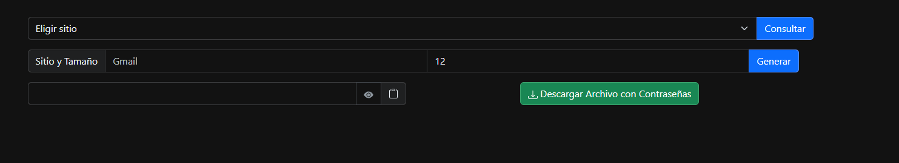

# Pass Generator

La siguiente es una aplicación para generar contraseñas. Las mismas son cadenas de caracteres aleatorios que
incluyen letras minusculas, mayusculas, números y simbolos. 

Dichas contraseñas se guardan en un archivo `.json` en Google Drive, lo que hace imprescindible iniciar sesión
con una cuenta de Google para poder utilizar esta app. Las contraseñas se guardan encriptadas con el algoritmo
AES el cual utiliza una llave secreta de 256 bits para encriptar y desincriptar las contraseñas. Dicha llave es
guardada en un archivo llamado **secrets.properties** de manera local.

## Instalación y Uso
La aplicación utiliza autenticacion de tipo OAuth2 para poder conectar con la API de Google. Esta pensada
para uso personal, por eso no fue diseñada para correr en un servidor por lo que si alguien quisiera usarla
necesitara un **Client ID** y un **Client Secret** de Google, [este video](https://www.youtube.com/watch?v=ex3FW_40izU)
explica bastante bien como hacerlo (en mi caso no fue necesario habilitar Google+ API). 
Los URL de origen deben ser http://localhost:8085, recomiendo configurarlo de la siguiente manera:


Una vez se tienen el **Client ID** y el **Client Secret**, crear un archivo de nombre `.env` en la raíz del proyecto
y cargar las credenciales con el siguiente formato:
```
GOOGLE_CLIENT_ID={client_id}
GOOGLE_CLIENT_SECRET={client_secret}
```
Reemplazar `{client_id}` y `{client_secret}` por los que te haya dado Google.

Al aplicacion se puede construir y levantar en un contenedor de Docker simplemente ejecutando el comando `docker compose up --build`,
dada la configuración en [Dockerfile](./Dockerfile) y [compose.yaml](compose.yaml).

Si todo esta bien deberias poder acceder a http://localhost:8085/ autenticarte con un correo de developer que hayas
especificados para conseguir la credenciales y ver la siguiente pagina: 




## TODO List
* Manejo de errores en el backend y una buena pagina de error
* ~~Funcionalidad para cargar un secret key ya existente~~
